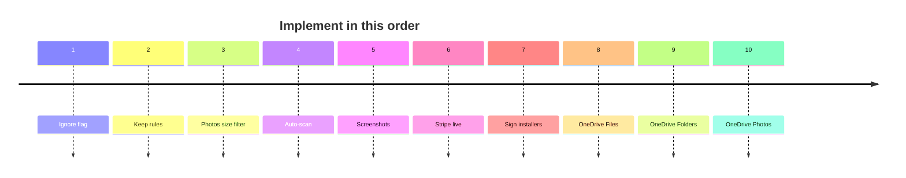

# DupSweep — Roadmap

Do the list **in order**. Tick an item when it ships, then start the next one. Do not start cloud login before step 7.

Compared to FileLister v1.21.0 (last Swift app). DupSweep already has local Files / Folders / Photos, Windows, license, site, and Stripe **test** checkout.

---

## Queue

- [ ] **1. Ignore flag** — per file, skip that copy in Clean All without deleting it (FileLister v1.1).
- [ ] **2. Keep rules** — Files mode: keep oldest / newest / largest / manual (Photos already have keeper priority).
- [ ] **3. Photos size filter** — min/max size, same as Files (FileLister v1.19).
- [ ] **4. Auto-scan** — start a search when the user adds a folder (FileLister v1.1).
- [ ] **5. Screenshots** — you provide captures; put them on `/`, `/mac`, `/windows`, `/photos`, Help, and `og-image`.
- [ ] **6. Stripe live** — live keys and webhooks, then one real 5€ purchase. Still test mode today.
- [ ] **7. Sign / notarize installers** — so Gatekeeper and SmartScreen stop warning.
- [ ] **8. OneDrive Files** — Entra + OAuth, folder picker, cloud file duplicates, delete to OneDrive recycle bin. Do **not** advertise login on the site until this works.
- [ ] **9. OneDrive Folders** — cluster + in-place merge + copy to new folder (FileLister v1.13 / v1.17).
- [ ] **10. OneDrive Photos** — Graph thumbnails + pHash (FileLister v1.21). Then Local/Remote bar and multi-account if needed.

PayPal and automated Hub deploys stay **off** this list on purpose.

---

## After 10 (only then)

Merge pie chart · native Quick Look · Google Drive / iCloud API / Dropbox · dashboard · scheduled scans · Finder extension · audio fingerprinting · exclusion presets.

---

## Already shipped (do not redo)

Local 3-mode app, SHA-256, folder merge, photo keepers, filters, undo, logs, trial + email key, on-disk OneDrive folder, Windows, website (FAQ, `/mac` `/windows` `/photos`, SEO, contact form), Stripe **test** checkout.
