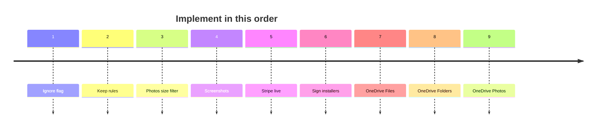

# DupSweep — Roadmap

Do the list **in order**. Tick an item when it ships, then start the next one. Do not start cloud login before step 6.

Compared to **FileLister v1.21.0** (last native Swift macOS app before the Tauri rewrite). DupSweep already has local Files / Folders / Photos, Windows, license, site, and Stripe **test** checkout.

Status in the detail tables below: ✅ Done · 🚧 In progress · 📋 Planned · ⏸ On hold

Update this file when something lands or a plan changes.

---

## Queue

- [x] **1. Ignore flag** — per file, skip that copy in Clean All without deleting it (FileLister v1.1).
- [x] **2. Keep rules** — Files mode: keep oldest / newest / largest / manual (Photos already have keeper priority).
- [x] **3. Photos size filter** — min/max size, same as Files (FileLister v1.19).
- [ ] **4. Screenshots** — you provide captures; put them on `/`, `/mac`, `/windows`, `/photos`, Help, and `og-image`.
- [ ] **5. Stripe live** — live keys and webhooks, then one real 5€ purchase. Still test mode today.
- [ ] **6. Sign / notarize installers** — so Gatekeeper and SmartScreen stop warning.
- [ ] **7. OneDrive Files** — Entra + OAuth, folder picker, cloud file duplicates, delete to OneDrive recycle bin. Do **not** advertise login on the site until this works.
- [ ] **8. OneDrive Folders** — cluster + in-place merge + copy to new folder (FileLister v1.13 / v1.17).
- [ ] **9. OneDrive Photos** — Graph thumbnails + pHash (FileLister v1.21). Then Local/Remote bar and multi-account if needed.

Auto-scan on folder add was considered and dropped — not wanted. PayPal and automated Hub deploys also stay **off** this list on purpose.

---

## Already in DupSweep (local)

These match FileLister’s local product, plus Windows. Do not redo.

| Feature | Status | Notes |
|---|---|---|
| Files / Folders / Photos modes | ✅ | Same 3-mode shell |
| SHA-256 file duplicates (name+size, then hash) | ✅ | Byte-verified before delete |
| Deep Scan, Media-only, No Hidden, Symlinks | ✅ | Files options |
| Confidence scoring | ✅ | 5-signal score on file groups |
| Folder clustering + match-ratio slider | ✅ | Union-find on content hashes |
| Folder merge: in-place, copy to new folder, review one-by-one, merge all, rename kept | ✅ | Collision-aware copy/merge |
| Collapsible folder clusters | ✅ | |
| Photos: dHash + pHash, EXIF corroboration, keeper, export keepers | ✅ | Ideas item “Similar Image Detection” is **done** — stale on the ideas board |
| Best-copy keeper priority (Settings) | ✅ | |
| Size filter (Files) | ✅ | |
| Include/exclude folders & extensions | ✅ | Session filters |
| Multi-folder scan (across / within) | ✅ | |
| Space preview (in-app) | ✅ | Not native Finder Quick Look |
| Safety lock (cannot trash last copy) | ✅ | |
| Undo (⌘Z / Ctrl+Z) + operation history | ✅ | |
| Logs JSON + HTML + PDF | ✅ | |
| Trial (15 deletions) + email-bound lifetime key | ✅ | Same algorithm as license-service |
| Help window | ✅ | Text only — no annotated screenshots |
| Windows + universal macOS | ✅ | FileLister was macOS-only |
| Scan OneDrive **folder on disk** | ✅ | No Microsoft login; online-only files must be downloaded first |
| Ignore flag per file | ✅ | Excluded from Clean All; session-only (cleared on new scan) |

---

## Missing vs FileLister (to implement)

### Local — small / high value (queue 1–4, plus later polish)

Port these from FileLister before cloud work.

| Feature | Queue | Status | FileLister | Notes |
|---|---|---|---|---|
| Ignore flag per file | 1 | ✅ | ✅ v1.1 | Exclude a copy from Clean All without deleting it |
| Auto-select keep rules (oldest / newest / largest / manual) | 2 | ✅ | ✅ | "Largest" mostly ties — Files-mode duplicates are byte-identical by construction |
| Photos min/max size filter | 3 | ✅ | ✅ v1.19 | Filters individual photos within a group, not whole groups |
| Merge composition pie chart | after 9 | 📋 | ✅ v1.15 | Merge sheets have counts, no pie |
| Help with annotated screenshots | 4 | 📋 | ✅ v1.3 | Needs real UI captures |
| Native Quick Look (macOS) | after 9 | 📋 | ✅ | Optional polish; in-app preview exists |
| Similarity-to-keeper % (Photos mode) | — | ✅ | ✅ | Hamming-distance-based "N% similar to keeper" shown per non-keeper photo — was already implemented, mis-tracked as planned |

Auto-scan when a folder is added (FileLister v1.1) was considered and **dropped on purpose** — DupSweep keeps requiring an explicit "Search for Duplicates" click.

### Cloud login — later (queue 7–9)

FileLister’s OneDrive stack. DupSweep site must **not** claim this until it ships. Order: **Files → Folders → Photos** (same as FileLister). Do not start before queue step 6.

| Feature | Queue | Status | FileLister | Notes |
|---|---|---|---|---|
| Entra app + OAuth (PKCE / device code) | 7 | 📋 | ✅ v1.11 | First step of OneDrive Files |
| Connect / sign out, account display | 7 | 📋 | ✅ | |
| Cloud folder picker | 7 | 📋 | ✅ v1.12 | |
| Scan limits (max files / max GB) | 7 | 📋 | ✅ | |
| OneDrive **Files** duplicates + delete to cloud recycle bin | 7 | 📋 | ✅ v1.11–1.12 | Use `quickXorHash` (not SHA-256) for cloud content |
| OneDrive **Folders** cluster + in-place merge + copy-to-new-folder | 8 | 📋 | ✅ v1.13 / v1.17 | |
| OneDrive **Photos** via Graph thumbnails + pHash | 9 | 📋 | ✅ v1.21 | |
| Local / Remote mode bar | 9 | 📋 | ✅ v1.17 | UI already shows a Local-only stub |
| Multi-connection (Keychain, picker, Settings) | 9 | 📋 | ✅ v1.18 | After single-account OneDrive works |
| Unified local + cloud duplicate report | after 9 | 📋 | partial | FileLister kept modes separate; a combined report is extra |

### Never built in FileLister either (don’t start yet)

| Feature | Status | Notes |
|---|---|---|
| Google Drive provider | 📋 | FileLister #8 — after OneDrive abstraction works |
| iCloud Drive API (not the on-disk folder) | 📋 | Ideas board |
| Dropbox | 📋 | Ideas board |
| FTP/FTPS | 📋 | FileLister #9 |
| Protect locally-synced files from remote delete | 📋 | FileLister #13 |
| Safe merge cloud → **local** folder | 📋 | FileLister deferred |

---

## Ideas board (beyond FileLister parity)

Nice-to-haves from VibeCoding Ideas. Not required to match FileLister. Only after queue 9.

| Feature | Status | Notes |
|---|---|---|
| Storage analytics dashboard | 📋 | Status bar already shows session savings |
| Scheduled auto-scans + notifications | 📋 | |
| Scan report export (PDF / CSV) | 📋 | Operation logs already exist (JSON/HTML/PDF) — this is a user-facing report |
| Finder / Explorer Quick Action | 📋 | |
| Duplicate music / audio fingerprinting | 📋 | |
| Smart exclusion presets | 📋 | Filters exist; presets do not |
| SHA-256 edge-case fixes | 📋 | Investigate against real reports |

---

## Site & selling (dupsweep.com / Hub)

| Item | Queue | Status | Notes |
|---|---|---|---|
| Landing page + Buy Widget + 5€ Stripe **test** checkout | — | ✅ | |
| FAQ (6 visible + more) | — | ✅ | |
| `/get-started` `/photos` | — | ✅ | Merged `/mac` + `/windows` into one unified page; old URLs redirect. Screenshot placeholders |
| Nav "Download" scrolls to license/payment section | — | ✅ | All 3 pages |
| License email includes support address | — | ✅ | Per-app (license-service) |
| SEO basics (www, canonical, sitemap, schema, README) | — | ✅ | |
| Contact / Feature Request form | — | ✅ | |
| OneDrive **folder** called out on the site | — | ✅ | Honest: on-disk only |
| Photos “When this helps” visuals on `/photos/` | — | ✅ | Mockups for bursts / exports / chat / screenshots — independent of queue 4 |
| Merge Features into `/get-started/` + screenshot carousel | — | ✅ | Moved homepage `#features` grid onto `/get-started/`; small-thumbnail lightbox replaced with an arrow-nav carousel (app-window frame) |
| Real UI screenshots on the site + `og:image` | 4 | 📋 | Waiting on captures |
| Stripe **live** keys / real 5€ purchases | 5 | 📋 | Next when ready to sell |
| Sign / notarize installers | 6 | 📋 | Gatekeeper / SmartScreen warn today |
| PayPal | — | ⏸ | After live Stripe; off the numbered queue on purpose |
| Automate site + license-service deploys | — | ✅ | GitHub Actions (Tailscale + rsync) on push, for dupsweep-site, VibeCoding Ideas, and license-service |

---

## After 9 (only then)

Merge pie chart · native Quick Look · Google Drive / iCloud API / Dropbox · dashboard · scheduled scans · Finder extension · audio fingerprinting · exclusion presets · unified local+cloud report · FTP · related FileLister backlog items above.

---

*Compared to FileLister v1.21.0. DupSweep is the Tauri rewrite (Mac + Windows), not a line-by-line port.*
