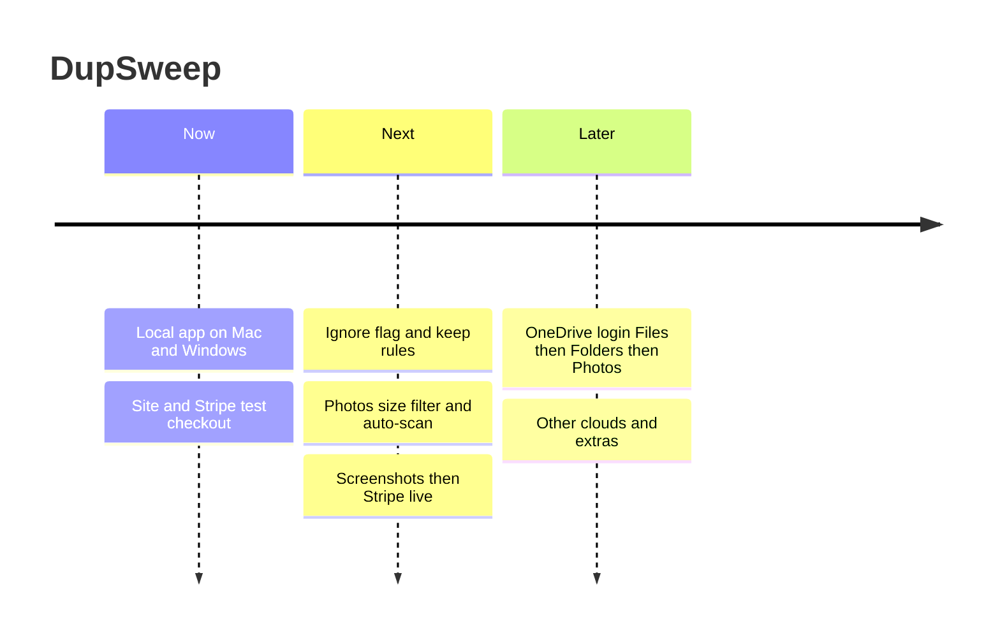

# DupSweep — Roadmap & Status

Single source of truth for what the **Tauri** app and **dupsweep.com** already have, and what is still missing. Compared against **FileLister v1.21.0** (last native Swift macOS app before the Tauri rewrite).

Status: ✅ Done · 🚧 In progress · 📋 Planned · ⏸ On hold

Update this file when something lands or a plan changes.

One timeline. Tables below are the detail.

---

## Already in DupSweep (local)

These match FileLister’s local product, plus Windows.

| Feature | Status | Notes |
|---|---|---|
| Files / Folders / Photos modes | ✅ | Same 3-mode shell |
| SHA-256 file duplicates (name+size, then hash) | ✅ | Byte-verified before delete |
| Deep Scan, Media-only, No Hidden, Symlinks | ✅ | Files options |
| Confidence scoring | ✅ | 5-signal score on file groups |
| Folder clustering + match-ratio slider | ✅ | Union-find on content hashes |
| Folder merge: in-place, copy to new folder, review one-by-one, merge all, rename kept | ✅ | Collision-aware copy/merge |
| Collapsible folder clusters | ✅ | |
| Photos: dHash + pHash, EXIF corroboration, keeper, export keepers | ✅ | Ideas item “Similar Image Detection” is **done** — stale on the ideas board |
| Best-copy keeper priority (Settings) | ✅ | |
| Size filter (Files) | ✅ | |
| Include/exclude folders & extensions | ✅ | Session filters |
| Multi-folder scan (across / within) | ✅ | |
| Space preview (in-app) | ✅ | Not native Finder Quick Look |
| Safety lock (cannot trash last copy) | ✅ | |
| Undo (⌘Z / Ctrl+Z) + operation history | ✅ | |
| Logs JSON + HTML + PDF | ✅ | |
| Trial (15 deletions) + email-bound lifetime key | ✅ | Same algorithm as license-service |
| Help window | ✅ | Text only — no annotated screenshots |
| Windows + universal macOS | ✅ | FileLister was macOS-only |
| Scan OneDrive **folder on disk** | ✅ | No Microsoft login; online-only files must be downloaded first |

---

## Missing vs FileLister (to implement)

### Local — small / high value

Port these from FileLister before cloud work.

| Feature | Status | FileLister | Notes |
|---|---|---|---|
| Ignore flag per file | 📋 | ✅ v1.1 | Exclude a copy from Clean All without deleting it |
| Auto-select keep rules (oldest / newest / largest / manual) | 📋 | ✅ | Files mode only; Photos already have keeper priority |
| Auto-scan when a folder is added | 📋 | ✅ v1.1 | DupSweep waits for “Search for Duplicates” |
| Photos min/max size filter | 📋 | ✅ v1.19 | Size filter is Files-only today |
| Merge composition pie chart | 📋 | ✅ v1.15 | Merge sheets have counts, no pie |
| Help with annotated screenshots | 📋 | ✅ v1.3 | Needs real UI captures |
| Native Quick Look (macOS) | 📋 | ✅ | Optional polish; in-app preview exists |

### Cloud login — later

FileLister’s OneDrive stack. DupSweep site must **not** claim this until it ships. Order: **Files → Folders → Photos**, then multi-connection.

| Feature | Status | FileLister | Notes |
|---|---|---|---|
| Entra app + OAuth (PKCE / device code) | 📋 | ✅ v1.11 | First step |
| Connect / sign out, account display | 📋 | ✅ | |
| Cloud folder picker | 📋 | ✅ v1.12 | |
| Scan limits (max files / max GB) | 📋 | ✅ | |
| OneDrive **Files** duplicates + delete to cloud recycle bin | 📋 | ✅ v1.11–1.12 | Use `quickXorHash` (not SHA-256) for cloud content |
| OneDrive **Folders** cluster + in-place merge + copy-to-new-folder | 📋 | ✅ v1.13 / v1.17 | |
| OneDrive **Photos** via Graph thumbnails + pHash | 📋 | ✅ v1.21 | |
| Local / Remote mode bar | 📋 | ✅ v1.17 | UI already shows a Local-only stub |
| Multi-connection (Keychain, picker, Settings) | 📋 | ✅ v1.18 | After single-account OneDrive works |
| Unified local + cloud duplicate report | 📋 | partial | FileLister kept modes separate; a combined report is extra |

### Never built in FileLister either (don’t start yet)

| Feature | Status | Notes |
|---|---|---|
| Google Drive provider | 📋 | FileLister #8 — after OneDrive abstraction works |
| iCloud Drive API (not the on-disk folder) | 📋 | Ideas board |
| Dropbox | 📋 | Ideas board |
| FTP/FTPS | 📋 | FileLister #9 |
| Protect locally-synced files from remote delete | 📋 | FileLister #13 |
| Safe merge cloud → **local** folder | 📋 | FileLister deferred |

---

## Ideas board (beyond FileLister parity)

Nice-to-haves from VibeCoding Ideas. Not required to match FileLister.

| Feature | Status | Notes |
|---|---|---|
| Storage analytics dashboard | 📋 | Status bar already shows session savings |
| Scheduled auto-scans + notifications | 📋 | |
| Scan report export (PDF / CSV) | 📋 | Operation logs already exist (JSON/HTML/PDF) — this is a user-facing report |
| Finder / Explorer Quick Action | 📋 | |
| Duplicate music / audio fingerprinting | 📋 | |
| Smart exclusion presets | 📋 | Filters exist; presets do not |
| SHA-256 edge-case fixes | 📋 | Investigate against real reports |

---

## Site & selling (dupsweep.com / Hub)

| Item | Status | Notes |
|---|---|---|
| Landing page + Buy Widget + 5€ Stripe **test** checkout | ✅ | |
| FAQ (6 visible + more) | ✅ | |
| `/mac` `/windows` `/photos` | ✅ | Screenshot placeholders |
| SEO basics (www, canonical, sitemap, schema, README) | ✅ | |
| Contact / Feature Request form | ✅ | |
| OneDrive **folder** called out on the site | ✅ | Honest: on-disk only |
| Real UI screenshots on the site + `og:image` | 📋 | Waiting on captures |
| Stripe **live** keys / real 5€ purchases | 📋 | Next when ready to sell |
| PayPal | ⏸ | After live Stripe |
| Automate Hub / license-service deploys | ⏸ | Manual rsync on purpose |
| Sign / notarize installers | 📋 | Gatekeeper / SmartScreen warn today |

---

PayPal and automated deploys stay on hold.

---

*Compared to FileLister v1.21.0. DupSweep is the Tauri rewrite (Mac + Windows), not a line-by-line port.*
